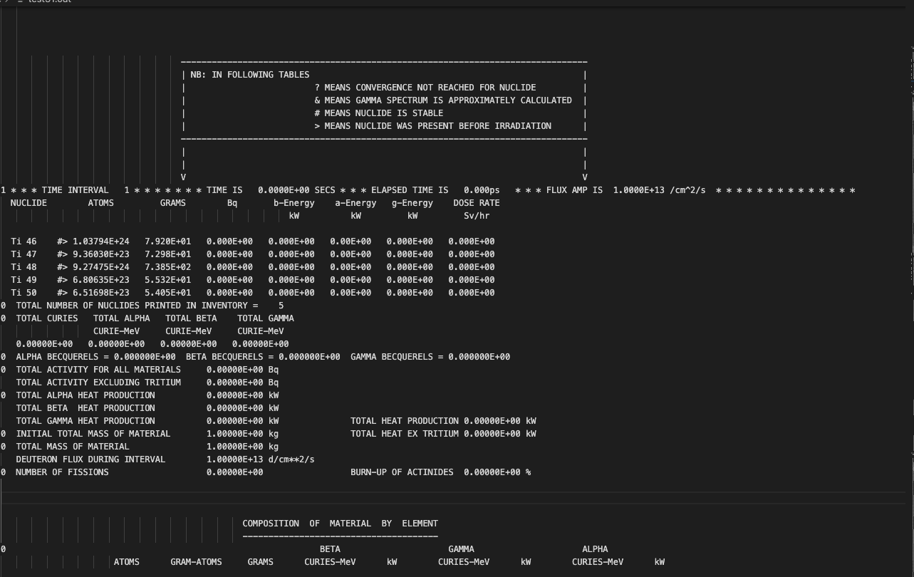

About
============
The (original) aim of Pypact was to make the FISPACT-II output file easy to parse so that more time can be spent on analysis,
and much less time on interrogating the output file. No more convoluted scripts, just one simple to use package!

The FISPACT-II output file is designed to be human readible but not computer readible, therefore it can be quite cumbersome to parse.
The standard .out file has no strict format, it is not XML, JSON, or CSV it is FISPACT-II custom format. Note since version 4 of FISPACT-II
there is now a JSON format to make it easier to parse (this was part of the reason pypact exists - to test the JSON output).

A typical output file from FISPACT-II will look something like below:

Over time we have seen many different people implement FISPACT-II output parsers in many different languages, some which are quite extensive,
with others designed to extract a few values from the output file. All, however, have never fully supported FISPACT-II features and are also
not open source. Enter pypact. Pypact is:

* open source
* supported by FISPACT-II developers
* well tested & validated
* easy to install & minimal dependencies
* python (this may be a pro or con depending on who you are)

The last point can of course be a problem for non python enthusiasts, and in that case
pypact cannot help you. However, from our experience many users of FISPACT-II like to use
python (very subjective).

Of course with an API in development parsing the output file could be a thing of the past (I hope!), however it will always be needed to write
file and manipulate them!